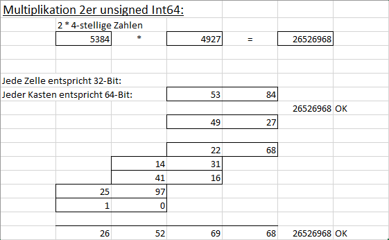

# Asm_Unsigned
## Unsigned arithmetic boolean and shifting operations for VB using VB.Long, VB.Currency and VB.Decimal

 

Project started in january 2022.  
VB does not have any intrinsic unsigned datatypes, except for the datatype Byte.  
This is a dll in asm with some functions to do arithmetic boolean and shifting operations on VB.Long and VB.Currency just like it were unsigned.  

